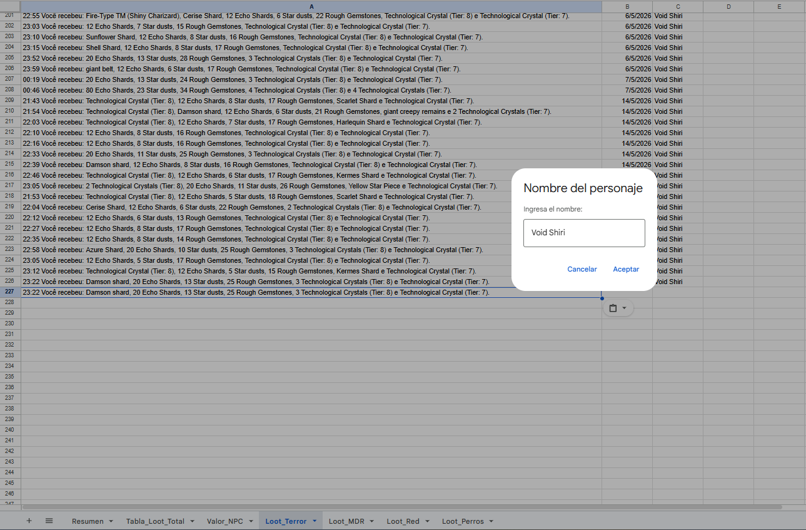

# Proyecto-Personal-Compilado-Loot-y-Dashboard

Automatización de extracción de datos provenientes de un CSV pegado por cada integrante del grupo, para creación de base de datos y Dashboard.

---

## Objetivo

Lograr obtener una base de datos proveniente de un texto pegado en un Google Sheet, que posteriormente derive en un Dashboard en Power BI.

---

## Funcionalidades

- Detección de distintos Items.
- Separación por cantidad e Items
- Cruce con base de datos de Precios NPC
- Automatización de fecha al pega el CSV
- Label consultando Nombre de Personaje
- Restricción en hoja especifica referente a Nombre de Personaje (4 horas de memoria de nombre)
- Consolidación de datos
- Automatización en actualización
- Integración en Google Sheet
- Creación de Dashboard en Power BI

---

## Procedimiento

1° Todo este proceso comienza con la culminación de algún contenido en el juego, el cual devolvera al jugador un mensaje tipo, los cuales pueden variar de la siguiente forma:

- 23:22 Você recebeu: Damson shard, 20 Echo Shards, 13 Star dusts, 25 Rough Gemstones, 3 Technological Crystals (Tier: 8) e Technological Crystal (Tier: 7).
- 22:34 You've received: Technological Crystal (Tier: 8), 8 Star dusts, 21 Rough Gemstones, Scarlet Shard and Technological Crystal (Tier: 7).
- 18:16 Has recibido: 994 tanzanite crystals, 95 Star dusts, 146 south sea pearls, 202 marquise emeralds, 11 Mystic Stars, 145 rough diamonds, 100 Echo Shards y 1030 pear tourmalines.

Este puede ser en Portugues, Inglés o Español, dependiendo el usuario. Una vez pegado este mensaje en la hoja correspondiente del contenido esta solicitará el nombre del personaje en cuestion, como se muestra en la siguiente imagen:



---

## Tecnoligías utilizadas

- JavaScript
- Google Sheet
- App Script
- Power BI

---

## Resultado

La automatización permitió contabilizar ganancia de jugadores en tiempo real y junto al dashboard poder visualizar de mejor manera el día de mayor ganancia, comparar con otros jugadores, el Item más valioso obtenido y la fecha, y finalmente distinguir quien ha logrado obtener mayores ganancias.

## Estructura del proyecto

```bash
Proyecto-Personal-Compilado-Loot-y-Dashboard/
│
├── 00_Fecha-Automatica-Nombre-Personaje.gs
├── 01_Obtener-Nombre-Personaje.gs
├── 02_Triggers.gs
├── 03_Maestro-de-Items.gs
├── 04_Generar-Tabla.gs
├── 05_Formato-Temporal.gs
├── 06_Consolidado-de-Bases.gs
├── 07_Crear-Base-de-Datos-SQL.gs //En proceso//
└── README.md
```

---

## Aprendizaje

- Automatización de creación de base de datos con Google Sheet
- Aplicación de JavaScript para uso de App Script
- Integración de datos de multiples fuentes de información
- Aplicación de Power BI con funciones DAX y marcadores
- Optimizar visualizaciones

---

## En proceso

- Creación de pagina Web
- Atajos para cada personaje en la Web para obtener su base de Google Sheet y Observar su Dashboard

---

## Autor

Kevin Daniel Shiray Vergara
