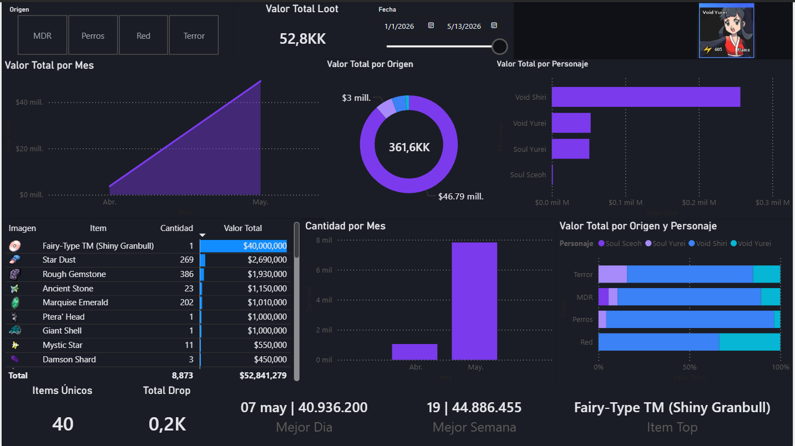
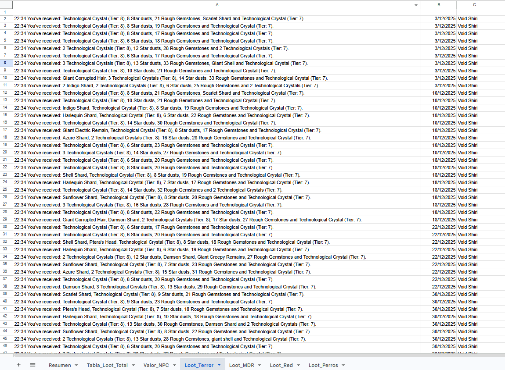
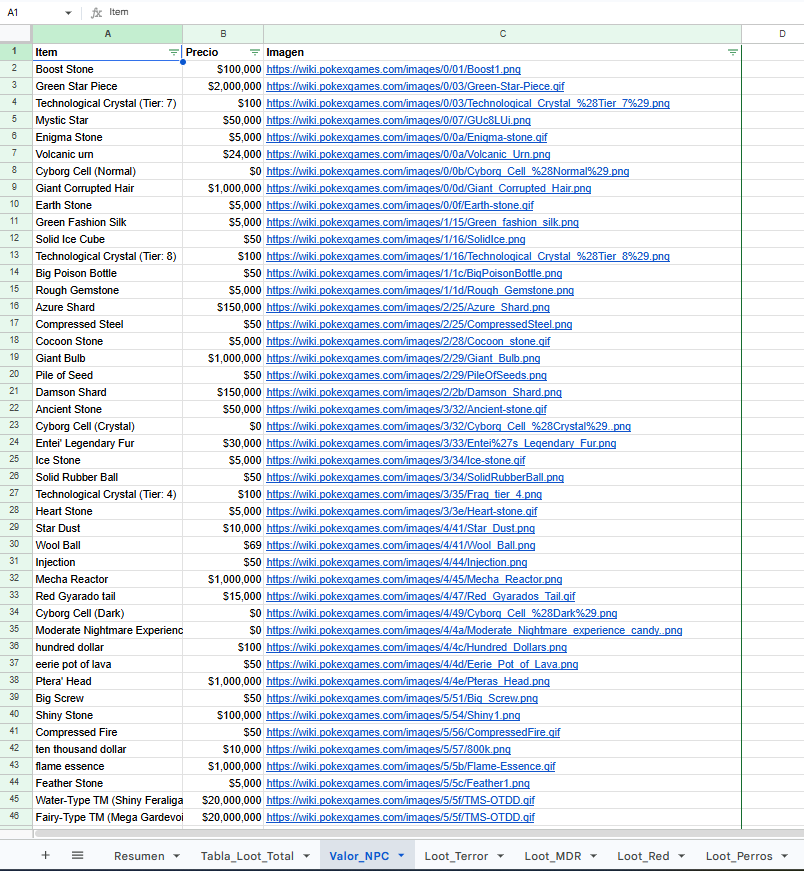
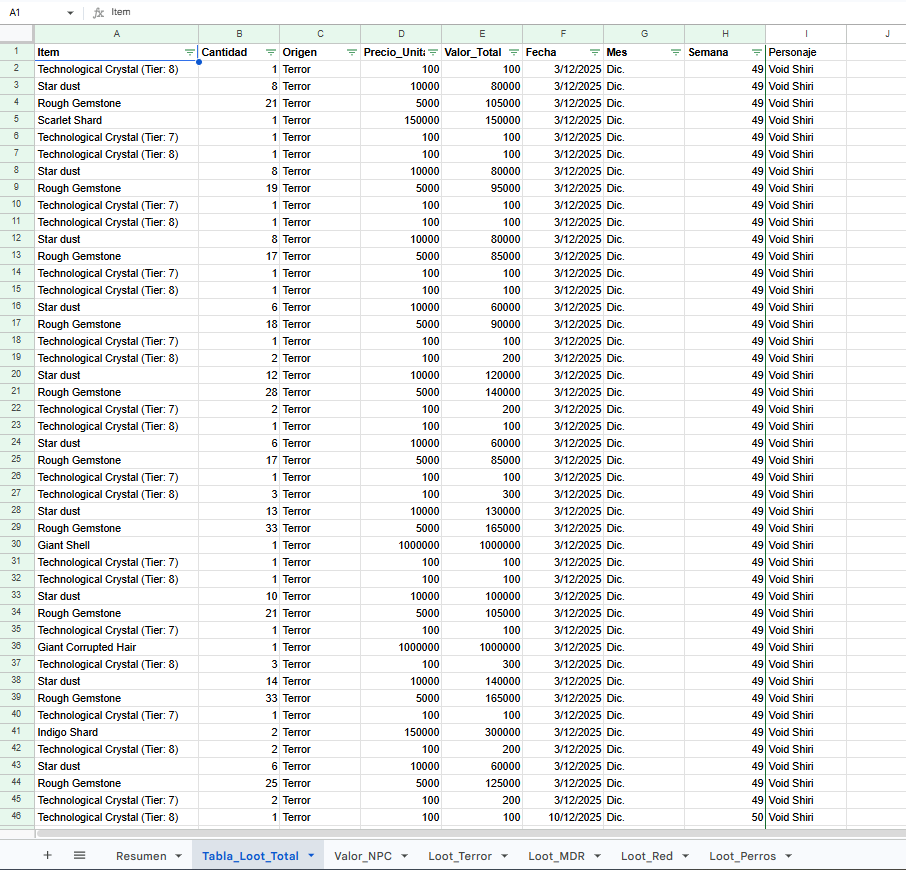
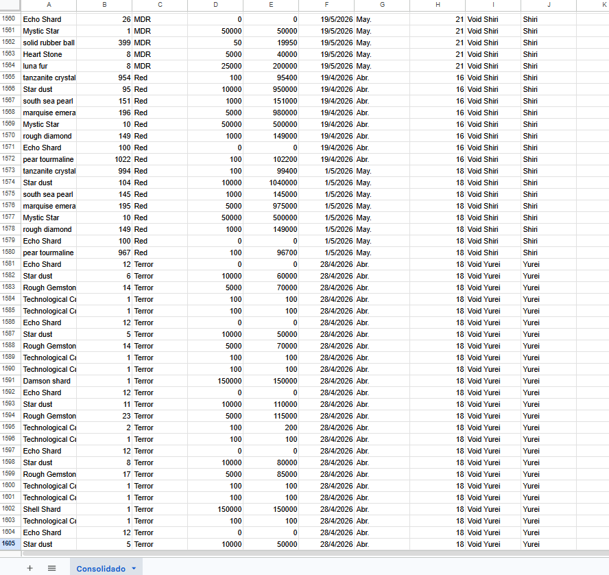

# Loot Data Automation & Power BI Dashboard

Automatización de extracción de datos provenientes de un CSV pegado por cada integrante del grupo, para creación de base de datos y Dashboard.

---

## Objetivo

Desarrollar una solución automatizada para capturar, transformar y consolidar información proveniente de mensajes generados dentro del juego, permitiendo la construcción de una base de datos centralizada y dashboards analíticos en Power BI.

---

## Funcionalidades

- Extracción automática de información desde mensajes generados en el juego
- Detección y separación de ítems y cantidades
- Cruce automatizado con base de precios NPC
- Registro automático de fechas y personajes
- Consolidación centralizada de datos
- Automatización de actualización de información
- Integración con Google Sheets y Power BI
- Visualización interactiva mediante dashboards analíticos

---

## Arquitectura de la Solución

El proyecto fue desarrollado como una solución automatizada de procesamiento y análisis de datos, permitiendo transformar mensajes generados dentro del juego en información estructurada y visualizable en tiempo real.

### Flujo de procesamiento

1. Captura de mensajes generados por jugadores
2. Extracción y limpieza automática de datos
3. Identificación de ítems y cantidades
4. Cruce con tabla de valorización NPC
5. Consolidación de múltiples fuentes de información
6. Estructuración de base de datos centralizada
7. Modelado y visualización en Power BI
8. Actualización automática de dashboards

## Dashboard Interactivo

<p align="center">
  <a href="https://app.powerbi.com/view?r=eyJrIjoiN2ZlMjA1OTUtYWM4Yy00NjllLThjYTItNmYzZWQ1OTRkZTg4IiwidCI6IjdjMmE5ZjE2LWUzNzItNDJhYi05NzZlLTUzYzIwODM3YWJkNyIsImMiOjR9">
    
  </a>
</p>

<p align="center">
  <b>Click en la imagen para abrir el dashboard interactivo</b>
</p>

---

## Proceso Automatizado

### 1. Captura y procesamiento del mensaje inicial

El proceso comienza una vez finalizado algún contenido dentro del juego. Como recompensa, el sistema entrega automáticamente un mensaje con los ítems obtenidos por el jugador. Dicho mensaje puede variar según el idioma configurado por el usuario (Portugués, Inglés o Español).

Ejemplos de mensajes procesados:

- 23:22 Você recebeu: Damson shard, 20 Echo Shards, 13 Star dusts, 25 Rough Gemstones, 3 Technological Crystals (Tier: 8) e Technological Crystal (Tier: 7).
- 22:34 You've received: Technological Crystal (Tier: 8), 8 Star dusts, 21 Rough Gemstones, Scarlet Shard and Technological Crystal (Tier: 7).
- 18:16 Has recibido: 994 tanzanite crystals, 95 Star dusts, 146 south sea pearls, 202 marquise emeralds, 11 Mystic Stars, 145 rough diamonds, 100 Echo Shards y 1030 pear tourmalines.

Una vez copiado y pegado el mensaje en la hoja correspondiente al contenido realizado, el sistema solicitará automáticamente el nombre del personaje asociado al registro.


---

### 2. Registro automático de información

Una vez ingresado y confirmado el nombre del personaje, el script registra automáticamente:

- Fecha del ingreso
- Nombre del personaje
- Contenido procesado
- Ítems obtenidos

Todo esto queda almacenado en una base estructurada para su posterior análisis.



---

### 3. Cruce de información y valorización automática

Al detectar un nuevo registro, el sistema ejecuta automáticamente un cruce entre los ítems obtenidos y la base de valores unitarios almacenada en la hoja `Valor_NPC`.



Como resultado, se genera una base consolidada que contiene:

- Cantidad obtenida
- Valor unitario
- Valor total
- Tipo de ítem
- Información del jugador



Con el objetivo de evitar pérdida o manipulación de información entre jugadores, cada usuario dispone de su propia planilla individual en Google Sheets.

---

### 4. Consolidación centralizada de información

Posteriormente, el sistema integra automáticamente todas las planillas individuales en una base consolidada centralizada, la cual contiene los siguientes campos:

| Item | Cantidad | Origen | Precio Unitario | Valor Total | Fecha | Mes | Semana | Personaje | Jugador |
|---|---|---|---|---|---|---|---|---|---|



La actualización de esta base se ejecuta automáticamente durante la madrugada, garantizando que la información se encuentre actualizada diariamente.

---

### 5. Visualización y análisis en Power BI

Finalmente, la base consolidada es conectada a Power BI, donde mediante el uso de:

- Funciones DAX
- Marcadores
- Modelado de datos
- Cruces entre tablas
- Visualizaciones dinámicas

se construyen dashboards interactivos que permiten analizar ganancias, ítems obtenidos y métricas operacionales del juego.

Además, el sistema incorpora automáticamente las imágenes de los ítems mediante el cruce entre la base consolidada y la tabla `Valor_NPC`.


---

## Tecnologías Aplicadas

- ETL Automation
- Google Apps Script
- Data Transformation
- Power BI
- DAX
- Data Modeling
- Dashboard Automation
- Data Visualization

---

## Resultado

La automatización permitió centralizar y estructurar información proveniente de múltiples usuarios en tiempo real, facilitando el análisis de ganancias, comportamiento de ítems y métricas operacionales mediante dashboards interactivos en Power BI.

La solución redujo significativamente el trabajo manual asociado a la consolidación de información y mejoró la visualización y trazabilidad de datos.

## Estructura del proyecto

```bash
Proyecto-Personal-Compilado-Loot-y-Dashboard/
│
├── 00_Fecha-Automatica-Nombre-Personaje.gs
├── 01_Obtener-Nombre-Personaje.gs
├── 02_Triggers.gs
├── 03_Maestro-de-Items.gs
├── 04_Generar-Tabla.gs
├── 05_Formato-Temporal.gs
├── 06_Consolidado-de-Bases.gs
├── 07_Crear-Base-de-Datos-SQL.gs //Planes Futuros
└── README.md
```

---

## Impacto Técnico

La solución permitió automatizar completamente el procesamiento manual de información proveniente de múltiples usuarios, reduciendo tiempos de consolidación y mejorando la disponibilidad de datos para análisis y visualización.

El sistema fue diseñado para trabajar con múltiples idiomas, múltiples fuentes de información y actualización automatizada diaria.

---

## Aprendizajes

- Desarrollo de procesos ETL utilizando Google Apps Script
- Automatización de captura y transformación de datos
- Integración y consolidación de múltiples fuentes de información
- Modelado y visualización de datos en Power BI
- Uso de funciones DAX y marcadores para dashboards interactivos
- Optimización de procesos de análisis y reporting

---

## Próximas Mejoras

- Desarrollo de interfaz web para acceso individual de jugadores
- Integración automatizada entre dashboards y perfiles de usuario
- Implementación de base de datos SQL para almacenamiento centralizado
- Escalabilidad del sistema para múltiples grupos y servidores

---

## Autor

Kevin Daniel Shiray Vergara
